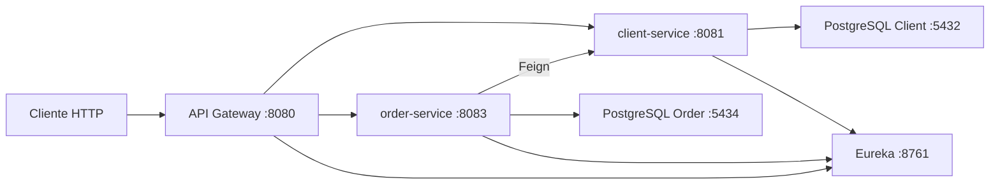

# Spring Cloud Microservices - Clientes e Pedidos

Projeto de portfolio backend Java com arquitetura de microservicos usando Spring Boot, Spring Cloud, API Gateway, Eureka, PostgreSQL, Docker e testes automatizados.

O objetivo e demonstrar uma base realista de backend corporativo: separacao por servicos, comunicacao entre APIs, validacoes de negocio, tratamento padronizado de erros, Docker Compose e testes que comprovam regras importantes.

## Problema de negocio

O sistema simula uma plataforma simples de pedidos:

- O `client-service` cadastra e gerencia clientes.
- O `order-service` cria e gerencia pedidos.
- Um pedido so pode ser criado para um cliente existente e ativo.
- Clientes nao podem ter email ou documento duplicado.
- Pedidos possuem fluxo de status e nao podem ser alterados quando finalizados.
- O `api-gateway` centraliza o acesso externo, propaga correlation id e protege rotas privadas com JWT.

Esse cenario foi escolhido porque representa problemas comuns em backend: CRUD, integracao entre servicos, validacao de regras, resiliencia basica, configuracao por ambiente e execucao local com containers.

## Arquitetura



### Servicos

| Servico | Porta | Responsabilidade |
| --- | --- | --- |
| `api-gateway` | `8080` | Entrada unica, JWT, correlation id, roteamento e circuit breaker |
| `client-service` | `8081` | CRUD de clientes, filtros, paginacao e validacao de duplicidade |
| `order-service` | `8083` | Pedidos, regras de status e consulta de clientes via Feign |
| `service-registry` | `8761` | Service discovery com Eureka |
| `postgres-client` | `5432` | Banco do client-service |
| `postgres-order` | `5434` | Banco do order-service |

## Tecnologias

- Java 17
- Spring Boot
- Spring Web
- Spring Data JPA
- Spring Validation
- Spring Cloud Gateway
- Spring Cloud OpenFeign
- Spring Cloud Netflix Eureka
- Resilience4j
- PostgreSQL
- H2 para execucao local/testes sem Docker
- Maven
- Docker e Docker Compose
- JUnit 5, Mockito e MockMvc

## Como rodar com Docker

Pre-requisitos:

- Docker Desktop
- Git

Passos:

```bash
git clone <url-do-repositorio>
cd spring-cloud-microservices
cp .env.example .env
docker compose up --build
```

No PowerShell, se preferir:

```powershell
Copy-Item .env.example .env
docker compose up --build
```

URLs principais:

- API Gateway: `http://localhost:8080`
- Client Service direto: `http://localhost:8081`
- Order Service direto: `http://localhost:8083`
- Eureka Dashboard: `http://localhost:8761`

Para parar:

```bash
docker compose down
```

Para parar removendo volumes locais:

```bash
docker compose down -v
```

## Como rodar localmente sem Docker

Cada servico usa H2 no profile padrao. Esse modo e util para testar regras de negocio e endpoints diretos sem subir PostgreSQL. Para validar o fluxo completo com Gateway + Eureka + bancos PostgreSQL, prefira Docker Compose.

Para rodar localmente, abra um terminal por servico:

```bash
cd service-registry
mvn spring-boot:run
```

```bash
cd client-service
mvn spring-boot:run
```

```bash
cd order-service
mvn spring-boot:run
```

```bash
cd api-gateway
mvn spring-boot:run
```

No Linux/macOS, defina o segredo antes de iniciar o gateway:

```bash
export JWT_SECRET=local-validation-secret-with-at-least-32-characters
mvn spring-boot:run
```

No PowerShell:

```powershell
$env:JWT_SECRET="local-validation-secret-with-at-least-32-characters"
mvn spring-boot:run
```

Observacao: para o fluxo completo via gateway em rotas protegidas, envie um JWT valido assinado com o mesmo `JWT_SECRET`. O projeto ainda nao possui um auth-service para emitir tokens; os endpoints publicos e os servicos diretos podem ser usados para validacao local.

## Variaveis de ambiente

Crie um `.env` a partir do `.env.example` antes de usar Docker Compose.

| Variavel | Uso |
| --- | --- |
| `CLIENT_DB_NAME` | Nome do banco PostgreSQL do client-service |
| `CLIENT_DB_USER` | Usuario do banco do client-service |
| `CLIENT_DB_PASSWORD` | Senha do banco do client-service |
| `ORDER_DB_NAME` | Nome do banco PostgreSQL do order-service |
| `ORDER_DB_USER` | Usuario do banco do order-service |
| `ORDER_DB_PASSWORD` | Senha do banco do order-service |
| `JWT_SECRET` | Segredo usado pelo gateway para validar JWT |
| `EUREKA_DEFAULT_ZONE` | URL do Eureka dentro do Docker |
| `CLIENT_SERVICE_URL` | URL interna usada pelo order-service para consultar clientes |

Exemplo para Docker:

```env
CLIENT_DB_NAME=clientdb
CLIENT_DB_USER=clientuser
CLIENT_DB_PASSWORD=change-me-client-password

ORDER_DB_NAME=orderdb
ORDER_DB_USER=orderuser
ORDER_DB_PASSWORD=change-me-order-password

JWT_SECRET=change-me-to-a-long-random-secret-with-at-least-32-characters
EUREKA_DEFAULT_ZONE=http://service-registry:8761/eureka
CLIENT_SERVICE_URL=http://client-api:8081
```

## Endpoints principais

### Gateway

| Metodo | Endpoint | Descricao |
| --- | --- | --- |
| `GET` | `/api/v1/clients/public/test` | Rota publica do client-service |
| `GET` | `/api/v1/orders/public/test` | Rota publica do order-service |
| `GET` | `/api/v1/clients` | Lista clientes, requer JWT |
| `POST` | `/api/v1/clients` | Cria cliente, requer JWT |
| `GET` | `/api/v1/orders` | Lista pedidos, requer JWT |
| `POST` | `/api/v1/orders` | Cria pedido, requer JWT |

### Client Service direto

Base URL: `http://localhost:8081`

O controller de clientes exige o header `X-User-Id` nas rotas privadas quando acessado diretamente.

| Metodo | Endpoint | Descricao |
| --- | --- | --- |
| `GET` | `/clients/public/test` | Health funcional publico |
| `POST` | `/clients` | Cria cliente |
| `GET` | `/clients/{id}` | Busca cliente por ID |
| `GET` | `/clients?page=0&size=10` | Lista clientes com paginacao |
| `GET` | `/clients?email=a@b.com` | Filtra por email |
| `GET` | `/clients?document=123` | Filtra por documento |
| `PUT` | `/clients/{id}` | Atualiza cliente completo |
| `PATCH` | `/clients/{id}` | Atualiza cliente parcial |
| `DELETE` | `/clients/{id}` | Remove cliente |

### Order Service direto

Base URL: `http://localhost:8083`

| Metodo | Endpoint | Descricao |
| --- | --- | --- |
| `GET` | `/orders/public/test` | Health funcional publico |
| `POST` | `/orders` | Cria pedido |
| `GET` | `/orders/{id}` | Busca pedido por ID |
| `GET` | `/orders?page=0&size=10` | Lista pedidos com paginacao |
| `PATCH` | `/orders/{id}/status?status=PROCESSING` | Atualiza status |

Status de pedido:

- `CREATED`
- `PROCESSING`
- `COMPLETED`
- `CANCELLED`

Regras principais:

- Pedido nasce com status `CREATED`.
- `CREATED` nao pode ir direto para `COMPLETED`.
- Pedidos `COMPLETED` ou `CANCELLED` nao podem ser alterados.
- Valor do pedido deve ser maior que zero.
- Cliente precisa existir e estar ativo.

## Exemplos de requisicoes

### Testar rota publica pelo gateway

```bash
curl http://localhost:8080/api/v1/clients/public/test
```

### Criar cliente direto no client-service

```bash
curl -X POST http://localhost:8081/clients \
  -H "Content-Type: application/json" \
  -H "X-User-Id: local-user" \
  -H "X-Correlation-Id: demo-001" \
  -d '{
    "name": "Maria Souza",
    "document": "12345678900",
    "email": "maria.souza@email.com",
    "phone": "11999999999"
  }'
```

### Listar clientes

```bash
curl -H "X-User-Id: local-user" \
  "http://localhost:8081/clients?page=0&size=10&sort=email,asc"
```

### Atualizacao parcial de cliente

```bash
curl -X PATCH http://localhost:8081/clients/1 \
  -H "Content-Type: application/json" \
  -H "X-User-Id: local-user" \
  -d '{
    "phone": "11888888888"
  }'
```

### Criar pedido direto no order-service

```bash
curl -X POST http://localhost:8083/orders \
  -H "Content-Type: application/json" \
  -H "X-Correlation-Id: demo-002" \
  -d '{
    "clientId": 1,
    "description": "Compra de materiais",
    "amount": 150.00
  }'
```

### Atualizar status do pedido

```bash
curl -X PATCH "http://localhost:8083/orders/1/status?status=PROCESSING"
```

### Rota protegida sem token no gateway

```bash
curl -i http://localhost:8080/api/v1/orders
```

Resposta esperada: `401 Unauthorized`.

## Formato padrao de erro

Os servicos retornam erros em formato padronizado:

```json
{
  "timestamp": "2026-07-08T15:00:00",
  "status": 400,
  "error": "Bad Request",
  "message": "Erro de validacao",
  "path": "/clients",
  "correlationId": "demo-001",
  "errors": [
    {
      "field": "email",
      "message": "Email invalido"
    }
  ]
}
```

## Testes

Executar todos os testes:

```bash
cd client-service && mvn clean test
cd ../order-service && mvn clean test
cd ../api-gateway && mvn clean test
cd ../service-registry && mvn clean test
```

Coberturas relevantes:

- Client: criacao, duplicidade de email/documento, patch parcial e paginacao.
- Order: cliente ativo/inativo/inexistente, valor invalido e transicoes de status.
- Gateway: rota publica, rota protegida sem token e propagacao de correlation id.

## Comandos uteis

```bash
docker compose up --build
docker compose ps
docker compose logs -f api-gateway
docker compose logs -f client-api
docker compose logs -f order-service
docker compose down
docker compose down -v
```

Build manual de um servico:

```bash
cd client-service
mvn clean package
```

Executar um servico:

```bash
mvn spring-boot:run
```

## Decisoes tecnicas relevantes

- Cada microservico tem seu proprio banco de dados.
- `order-service` consulta `client-service` via OpenFeign.
- `api-gateway` adiciona/propaga `X-Correlation-Id`.
- Erros seguem o mesmo contrato em `client-service` e `order-service`.
- Configuracoes sensiveis ficam em variaveis de ambiente.
- Dockerfiles fazem build multi-stage, sem depender de JAR gerado manualmente.
- Testes foram ajustados para validar regra de negocio, nao apenas subir contexto.

## Autor

Jonathan Leite

Projeto desenvolvido para portfolio profissional com foco em vagas de Desenvolvedor Backend Java.
